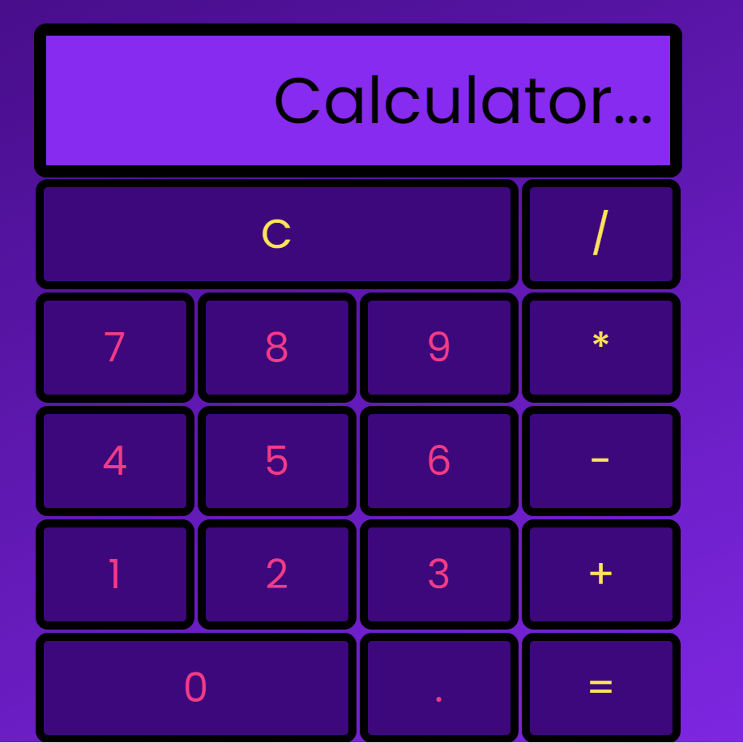

# nology_calculator

Skills

<ul>
<li>HTML</li>
<li>CSS</li>
<li>SASS</li>
<li>BEM</li>
<li>Figma</li>
<li>Git & GitHub</li>
</ul>

JavaScript

<ul>
<li> Functions </li>
<li>Event Listeners</li>
</ul>

This was my first vanilla JavaScript project on the nology course. 

I used hard code HTML to create my calculator and JavaScript for it's functionality.

I used event listeners to activate the buttons and functions to calculate.

